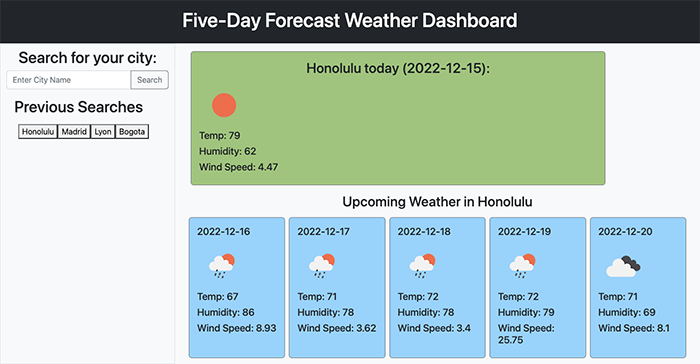
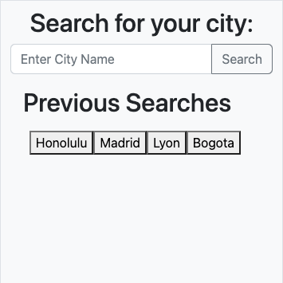

# five-day-forecast-dashboard

## Table of Contents
- [Description](#Description)
- [Usage](#Usage)
- [Visuals](#Visuals)

## Description
- [Click here to access my weather dashboard](https://mariahmcdaniel.github.io/five-day-forecast-dashboard/)

For this project, my goal was to create a weather dashboard in which a user can search for a city and then receive the weather forecast displayed on the page. After you search for a city, the city name will be saved to the page as a button so that you can quickly access that city's forecast the next time you access the application from the device you used to do the initial search. 

## Usage

You can use this [five-day forecast dashboard](https://mariahmcdaniel.github.io/five-day-forecast-dashboard/) to get the current weather, along with the forecast for the next 5 days.

## Visuals

